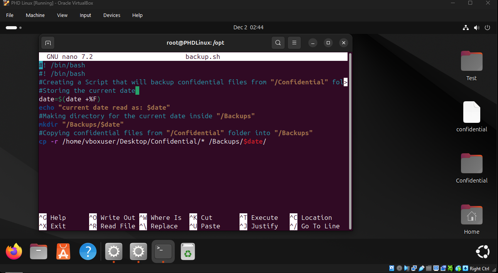
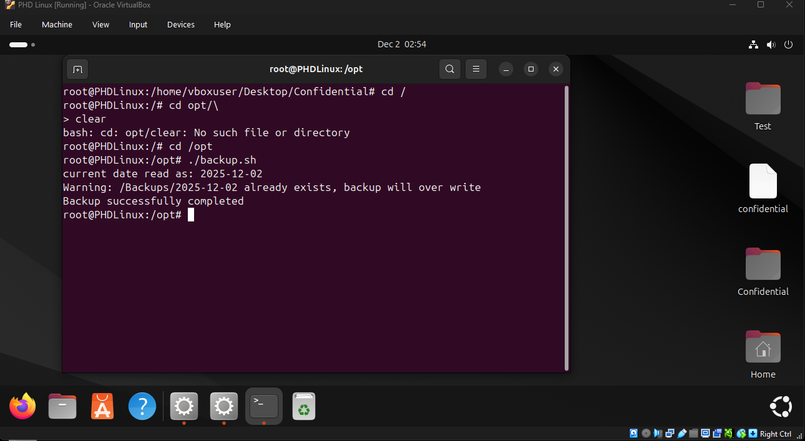
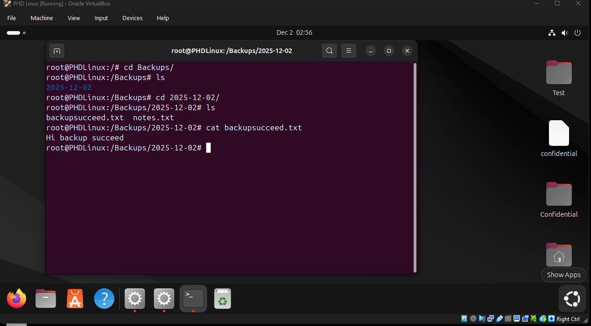
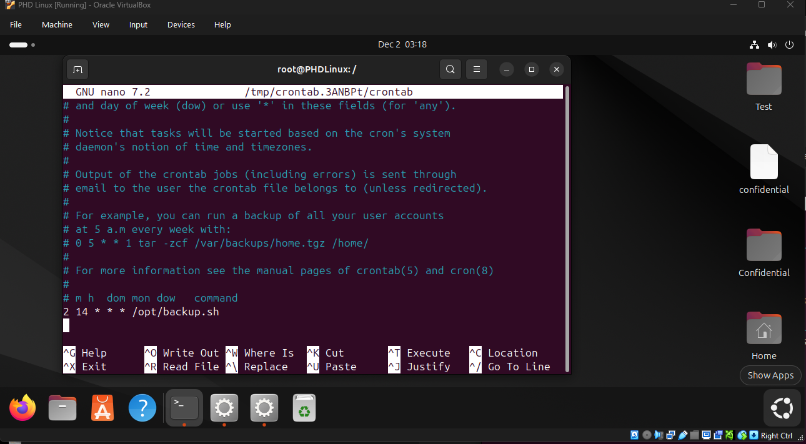

# 🐧 Linux Automated Backup Script

> A Bash-based automation script that performs daily file backups using cron scheduling, designed to simulate real-world Linux system administration tasks.

---

## 📌 Overview

This project demonstrates how to automate **daily file backups** in a Linux environment using a Bash script and cron.

The script copies files from a designated **source directory** into a structured backup location, organised by date (`YYYY-MM-DD`). This approach ensures that files are preserved daily, supporting **basic disaster recovery and data protection practices**.

The backup process is fully automated using cron, eliminating the need for manual execution.

---

## 🎯 Objectives

- Automate repetitive backup tasks using **Bash scripting**
- Implement **date-based backup organisation**
- Use **cron jobs** for scheduled execution
- Simulate a real-world **system administration workflow**
- Demonstrate awareness of **data protection and recovery**

---

## ✨ Features

- 📁 Automatic creation of date-based backup folders  
- 🔁 Recursive file copying from source to backup location  
- ⚙️ Scheduled daily execution using cron  
- 🛡️ Basic data protection through backup redundancy  
- 📊 Clear terminal output for execution status  

---

## 🛠️ Technologies Used

- Linux (Ubuntu / Debian-based system)
- Bash scripting
- Cron (task scheduler)

---

## 📂 Project Structure

```
Linux-Backup-Script/
│
├── Backup.sh
├── Screenshots/
│   ├── Editing_Script_Screenshoot_1.png
│   ├── Running_Script_2.png
│   ├── Backup_Folder_3.png
│   └── Running_Scrip_2_Crontab.png
└── README.md
```

---

## ⚙️ Script Explanation

The script performs the following operations:

1. Retrieves the current system date  
2. Checks if a backup directory for that date exists  
3. Creates the directory if it does not exist  
4. Copies all files from the source directory into the backup folder  
5. Displays success or warning messages  

---

## 📜 Script

```bash
#!/bin/bash

SOURCE="/home/vboxuser/Desktop/Confidential"
BACKUP_ROOT="/Backups"
CURRENT_DATE=$(date +%F)
DESTINATION="$BACKUP_ROOT/$CURRENT_DATE"

echo "Current date: $CURRENT_DATE"

if [ ! -d "$SOURCE" ]; then
    echo "Error: Source directory does not exist: $SOURCE"
    exit 1
fi

if [ ! -d "$DESTINATION" ]; then
    echo "Creating backup directory: $DESTINATION"
    mkdir -p "$DESTINATION"
else
    echo "Backup directory already exists: $DESTINATION"
fi

cp -r "$SOURCE"/. "$DESTINATION"/

if [ $? -eq 0 ]; then
    echo "Backup completed successfully."
else
    echo "Backup failed."
    exit 1
fi
```

---

## 🚀 How to Use

### 1. Clone the Repository

```bash
git clone https://github.com/YOUR_USERNAME/Linux-Backup-Script.git
cd Linux-Backup-Script
```

---

### 2. Make the Script Executable

```bash
chmod +x Backup.sh
```

---

### 3. Run the Script

```bash
./Backup.sh
```

---

## ⏰ Automating with Cron

### Open crontab

```bash
sudo crontab -e
```

---

### Add the job

```bash
2 14 * * * /opt/Backup.sh
```

---

### 🧾 Cron Schedule Breakdown

| Field | Value | Meaning |
|------|------|--------|
| Minute | 2 | At minute 2 |
| Hour | 14 | At 14:00 (2 PM) |
| Day of Month | * | Every day |
| Month | * | Every month |
| Day of Week | * | Every day |

---

## 📸 Screenshots

### 📝 Editing Script


### ▶️ Running Script


### 📁 Backup Folder Created


### ⏰ Cron Job Setup


---

## 🧠 Key Learning Outcomes

- Developed practical experience with **Bash scripting**
- Learned how to automate tasks using **cron jobs**
- Improved understanding of **Linux file systems**
- Applied **basic backup and recovery concepts**
- Gained confidence working in a **command-line environment**

---

## 🔒 Real-World Relevance

This project reflects tasks commonly performed by:

- Junior System Administrators  
- IT Support Engineers  
- DevOps Trainees  

Automated backups are essential in production environments to:

- Prevent data loss  
- Support incident recovery  
- Maintain operational continuity  

---

## ⚠️ Limitations & Future Improvements

### Current Limitations
- No logging system  
- No compression of backups  
- No retention policy (old backups not deleted)  

### Planned Improvements
- Add logging (`backup.log`)  
- Implement compression using `tar`  
- Add retention policy (e.g., keep last 7 days)  
- Add email notifications for failures  
- Improve error handling  

---

## 🎤 How to Explain This Project in an Interview

> I created a Bash script that automates daily backups of files in a Linux environment. The script checks for a date-based directory, creates it if necessary, and copies files from a source location. I then scheduled it using cron so it runs automatically every day. This project helped me understand automation, Linux file management, and basic backup strategies used in real systems.

---

## ⭐ Final Notes

This project demonstrates **practical Linux administration skills** and a proactive approach to learning automation and system reliability.
